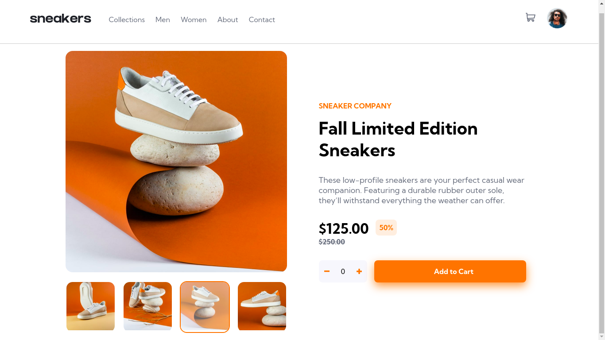
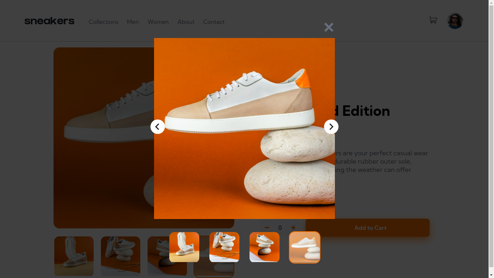
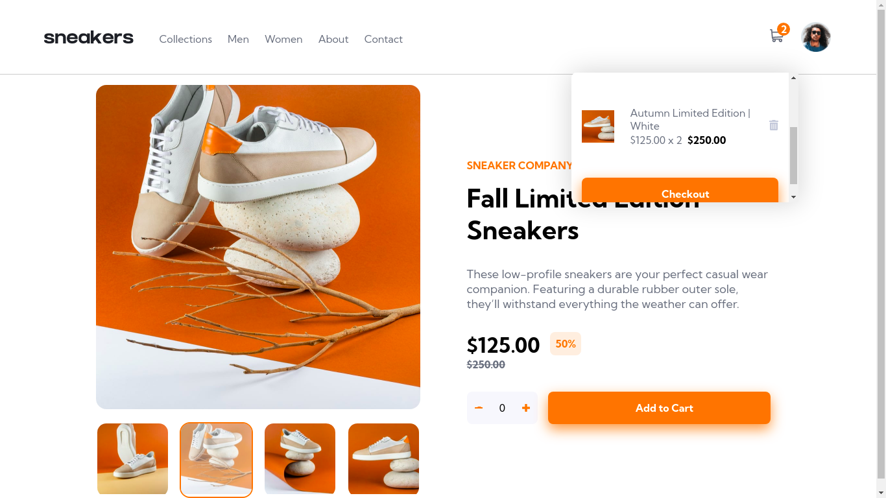

# README

<h1 align="center">Sneakers E-commerce</h1>

----
<h1></h1>
<h1></h1>
<h1></h1>

<h2 align="center">Tabela de conteúdos</h2>
<p align="center">
  <a href="#-sobre">Sobre</a> |
  <a href="#pre-requisitos">Pre-requisitos</a> |
  <a href="#instalacao">Instalação</a> |
  <a href="#tecnologias">Tecnologias</a>
</p>

## ❔ Sobre
<p>E-commerce de Tênis criado com ReactJS</p>

## 📝 Pre-Requisitos

Antes de iniciar o projeto, você vai precisar ter instalado na sua máquina as seguintes ferramentas:

- [Git](https://git-scm.com)
- [Node.js](https://nodejs.org)

Além disto para editar algo no projeto utilize o [Visual&nbsp;Studio&nbsp;Code](https://code.visualstudio.com/) como editor de Código.

## ✅ Instalação

```bash
# Clone este repositório
$ git clone https://github.com/DanteBenicio/sneakers-ecommerce-react

# Acesse a pasta do projeto
$ cd sneakers-ecommerce-react

# Instale as dependências (Yarn)
$ yarn

# Execute a aplicação (Yarn)
$ yarn start

# O servidor iniciará na URL (Porta 3000) - http://localhost:3000/
```

## ✨ Tecnologias

- [React](https://reactjs.org.com)
- [Typescript](https://typescriptjs.org.com)
- [Styled-components](https://styled-componentsjs.org.com)
